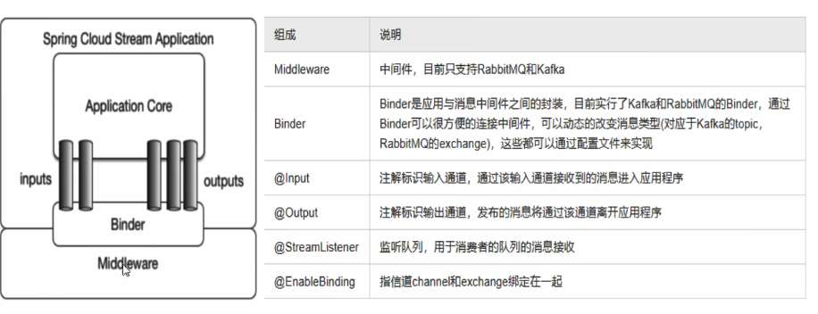

# 1.Stream是什么
Stream是SpringCloud的MQ封装框架，它能够屏蔽掉不同MQ的差异，如MyBatis对接MySQL或Oracle可以屏蔽差异
注意：目前Stream只支持KAFKA和RabbitMQ
Stream的组成结构如下


# 2.Stream使用步骤（RabbitMQ为例）
## 2.1必要的依赖
省略了web、注册中心、actuator依赖没给出
```xml
<dependency>
   <groupId>org.springframework.cloud</groupId>
   <artifactId>spring-cloud-starter-stream-rabbit</artifactId>
</dependency>
```
## 2.2配置
### 2.2.1生产者
```yaml
spring:
  application:
    name: cloud-stream-producer
  #rabbitmq 连接配置
  rabbitmq:
    host: 192.168.56.128
    port: 5672
    username: guest
    password: guest
  cloud:
    #stream配置
    stream:
      #定义要绑定的中间件
      binders:
        #defaultRabbit是自己定义的名称，而type的值由官方指定的
        defaultRabbit:
          type: rabbit
      #定义mq对应的channel信息
      bindings:
        output:
          #定义rabbit的exchange相当于kafka的topic
          destination: studyExchange
          #传输数据类型
          content-type: application/json
          #绑定在binders中定义的中间件
          binder: defaultRabbit
```
### 2.2.2消费者
注意：
1. group这个字段的配置，名称相同的是同一组，如果配置group的话，服务每次启动会有一个默认名称
2. 配置成同一个组，可以解决重复消费的问题，即相同组之间的消费者不会重复消费消息，采用负载均衡的方式消费
3. 配置了组信息，可以消息持久化。持久化的含义是，如果生产者生产了一组消息，此时没有消费者成员，那么等到有消费者
上线时，这组生产的消息也不会被后来上线的消费者消费了，相当于丢失了，但是如果配置了组信息则可以解决这个问题
```yaml
spring:
  application:
    name: cloud-stream-consumer
  rabbitmq:
    host: 192.168.56.128
    port: 5672
    username: guest
    password: guest
  cloud:
    stream:
      binders:
        defaultRabbit:
          type: rabbit
      bindings:
        input:
          destination: studyExchange
          content-type: application/json
          binder: defaultRabbit
          #定义分组，相同的组不会导致消息重复消费，不同组会消息重复消费
          group: consumer_a
```
## 2.3生产与消费
### 2.3.1生产者
如下定义了一个接口与实现类，需要发送消息时直接调用send方法即可
注意：@EnableBinding(Source.class)注解
和
@Resource
private MessageChannel output;
的用法即可
```java
public interface Producer {
    boolean send(Object msg);
}

//消息生产管道
@EnableBinding(Source.class)
public class ProducerImpl implements Producer {

    //消息输出管道
    @Resource
    private MessageChannel output;

    @Override
    public boolean send(Object msg) {
        return output.send(MessageBuilder.withPayload(msg).build());
    }
}
```
### 2.3.2消费者
注意@EnableBinding(Sink.class)、@StreamListener(Sink.INPUT)、Message<String> message
@StreamListener(Sink.INPUT)定义的方法必须是void类型（要定义其他返回类型需要特殊处理），且该方法是自动触发。
```java
@Component
@EnableBinding(Sink.class)
public class Consumer {

    @Value("${server.port}")
    private Integer port;

    //这个方法是自动触发
    @StreamListener(Sink.INPUT)
    public void consumer(Message<String> message) {
        System.out.println(String.format(
                "port:{%s},consume:{%s}", port, message.getPayload()
        ));
    }
}
```