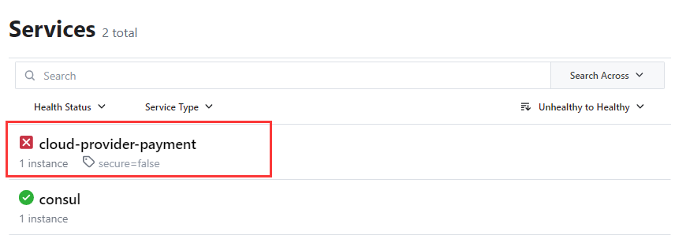

# consul下载与启动
[官方地址](https://developer.hashicorp.com/consul/downloads)
1. Centos
```text
   sudo yum install -y yum-utils
   sudo yum-config-manager --add-repo https://rpm.releases.hashicorp.com/RHEL/hashicorp.repo
   sudo yum -y install ribbon
```
注意：Centos下启动consul，后再windows端无法访问到8500端口，在虚拟机中的服务可以正常访问（目前还没有解决这个问题）
2. windows
   windows直接在官网下载对应版本软件即可
3. docker
   docker run -d -p 8500:8500 --name ribbon ribbon agent -server -bootstrap-expect=1 -client 0.0.0.0 -ui
4. 启动consul
在windows和linux下运行如下命令（linux下有上述的bug问题）
ribbon agent -dev
启动后可以通过访问8500端口查看consul的webUI

# consul使用
1. 必要依赖
```xml
   <dependency>
       <groupId>org.springframework.cloud</groupId>
       <artifactId>spring-cloud-starter-netflix-eureka-server</artifactId>
   </dependency>
   <dependency>
      <groupId>org.springframework.boot</groupId>
      <artifactId>spring-boot-starter-web</artifactId>
   </dependency>
   <dependency>
      <groupId>org.springframework.boot</groupId>
      <artifactId>spring-boot-starter-actuator</artifactId>
   </dependency>
```
2. 配置
```yaml
server:
  port: 8006
spring:
  application:
    name: cloud-provider-payment
  cloud:
    ribbon:
      # consul注册中心地址
      host: 192.168.0.44
      port: 8500
      discovery:
        hostname: 192.168.0.233 #本功能模块的地址
        service-name: ${spring.application.name}
        #添加心跳检查
        heartbeat:
          enabled: true
```
注意：如果出现如下情况，加入heartbeat.enabled=true即可

3. 启动类注解@EnableDiscoveryClient
4. 服务调用端步骤相同