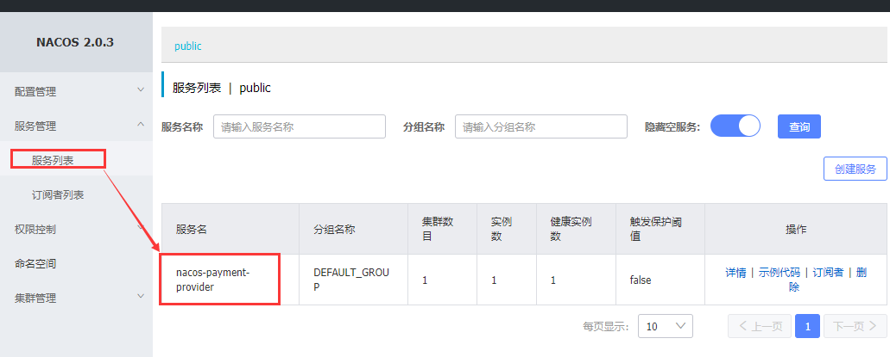

# 1.nacos服务端安装
## 1.1 Windows安装
下载对应版本，在bin目录启动startup.cmd
## 1.2 Linux安装
下载对应版本，在bin目录启动startup.sh
## 1.3 Docker安装

## 1.4 切换存储到MySQL

## 1.5 集群配置NGINX+NACOS+MYSQL

# 2.nacos客户端使用
## 2.1必要依赖
注意：省略了actuator和web没有给出
```xml
<!--服务发现-->
<dependency>
   <groupId>com.alibaba.cloud</groupId>
   <artifactId>spring-cloud-alibaba-nacos-discovery</artifactId>
</dependency>
<dependency>
<!--服务注册-->
<dependency>
    <groupId>com.alibaba.cloud</groupId>
    <artifactId>spring-cloud-starter-alibaba-nacos-discovery</artifactId>
</dependency>
```
## 2.2 服务注册
### 2.2.1配置
```yaml
server:
  port: 9001
spring:
  application:
    name: alibaba-nacos-payment
  cloud:
    # nacos配置
    nacos:
      discovery:
        #nacos的服务地址（注意，如果是集群模式怎么配置）
        server-addr: 127.0.0.1:8848

management:
  endpoints:
    web:
      exposure:
        include: '*'
```
### 2.2.2 启动类
```java
@SpringBootApplication
@EnableDiscoveryClient
public class Nacos9001 {
    public static void main(String[] args) {
        SpringApplication.run(Nacos9001.class, args);
    }
}
```
注意：
1. nacos服务启动成功后，待注册的服务如果注册进入了nacos，可以在8848端口的webui查看

2. nacos自带了ribbon的依赖，可以搭配ribbon或者openfeign使用
## 2.3 服务配置
### 2.3.1 配置
bootstrap.yml
```yaml
server:
  port: 3377
spring:
  application:
    name: nacos-config-client
  cloud:
    nacos:
      #Nacos服务注册相关配置
      discovery:
        server-addr: 192.168.56.128:8848  
      #Nacos服务配置相关配置
      config:
        server-addr: 192.168.56.128:8848  #Nacos服务地址
        #指定选择拉取文件的格式尾缀，如下指定了拉取.yml的文件
        file-extension: yml 
        group: "SJ_GROUP" #设置组信息，不设置默认是DEFAULT_GROUP
        namespace: ebb54b8d-f01f-40ba-8f7e-bf3b862176e0 #配置命令空间，不设置默认是PUBLIC
```
application.yml
```yaml
spring:
  profiles:
    active: info
```
### 2.3.2 拉取的配置数据与application.name、file-extension、active的关系
当一个微服务项目启动时，它向nacos拉取的配置是
${spring.application.name}-${spring.profile.active}.${spring.cloud.nacos.config.file-extension}
如上面配置的结果，拉取的文件是nacos-config-client-info.yml。
注意：如果无法正常拉取文件（nacos没有该文件，或者文件中缺少某必要配置）则项目会无法正常启动。
### namespace、group
namespace和group相当于分组管理，相同ns和group只能有一个同名文件。
如果在配置中不指定namespace和group，则ns默认值是PUBLIC、group是DEFAULT_GROUP。

