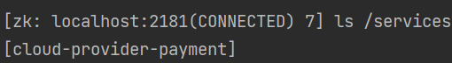
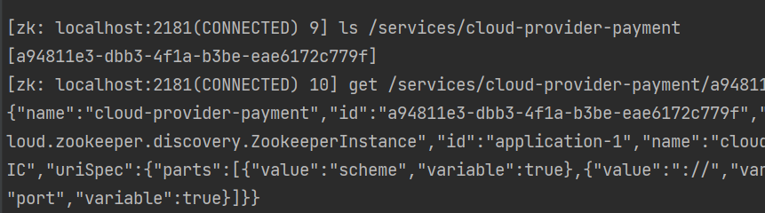

# 使用步骤
1. 安装好ZK集群
2. 导入必要依赖
```xml
    <dependency>
        <groupId>org.springframework.boot</groupId>
        <artifactId>spring-boot-starter-web</artifactId>
    </dependency>
    
    <dependency>
        <groupId>org.springframework.cloud</groupId>
        <artifactId>spring-cloud-starter-zookeeper-discovery</artifactId>
    </dependency>
```
3. 配置ZK
```yaml
    server:
      port: 8004

    spring:
      application:
        name: cloud-provider-payment #同一个服务端的名称必需相同，这个名称会在ZK的/services目录注册
      cloud:
        zookeeper:
          connect-string: 192.168.0.44:2181, 192.168.0.18:2181
```
4. 启动类注解@EnableDiscoveryClient
```java
@SpringBootApplication
@EnableDiscoveryClient
public class ZookeeperPayment8004 {
    public static void main(String[] args) {
        SpringApplication.run(ZookeeperPayment8004.class, args);
    }
}
```
5. 查看ZK服务端状态
服务正常启动被注册进入ZK后，ZK会产生一个/services目录，该目录下有注册的服务（application.name的名称）

查看具体服务内部，会有注册好的节点信息，如下注册了一个节点，如果注册了多个同模块节点
该模块下就会有多个节点的信息。

节点信息中有节点的ip和端口号属性
```text
{
  "name": "cloud-provider-payment",
  "id": "a94811e3-dbb3-4f1a-b3be-eae6172c779f",
  "address": "SonLaptop", #可能是ip地址也可能是dns
  "port": 8004 #端口号
  .....
}
```
6. 调用端
调用端的步骤和上面完全相同，但是调用端的application.name不一样，因为不是同一个功能模块
调用端使用RestTemplate的步骤也完全一致