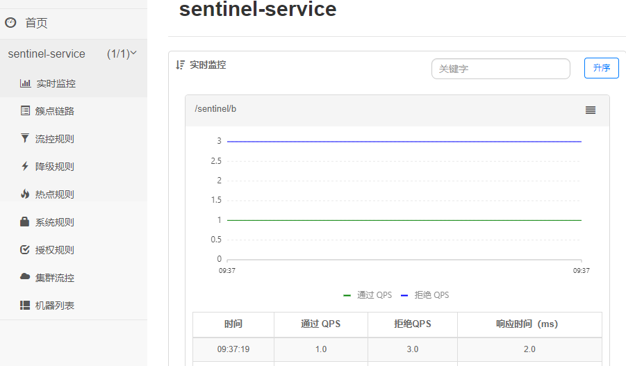
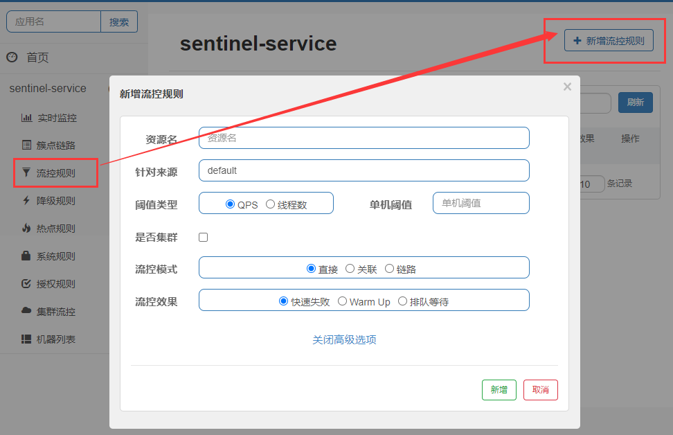
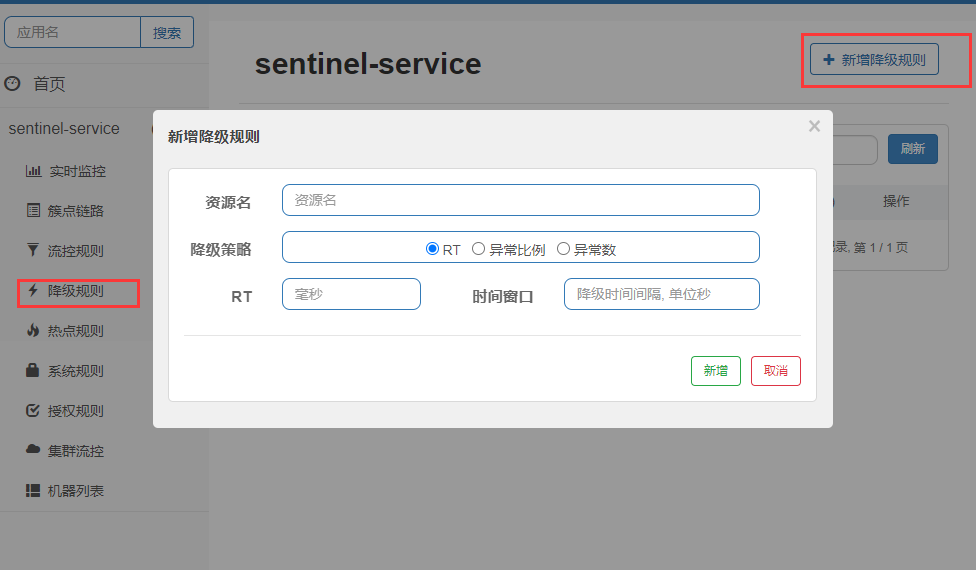
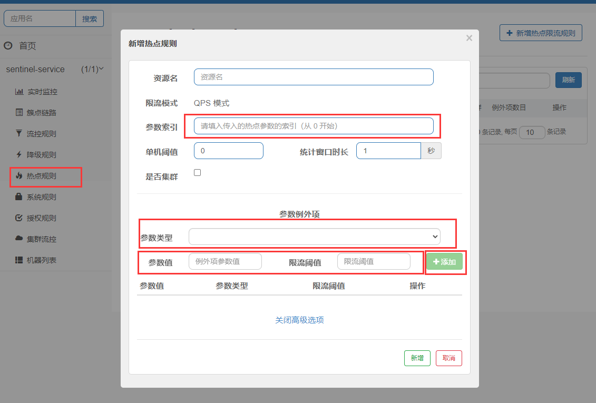
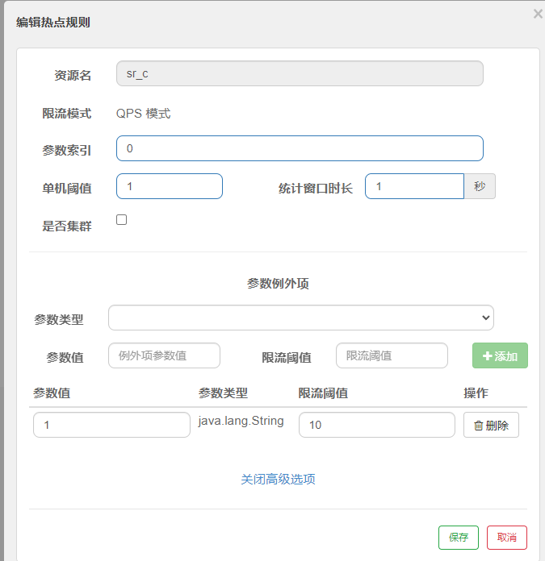
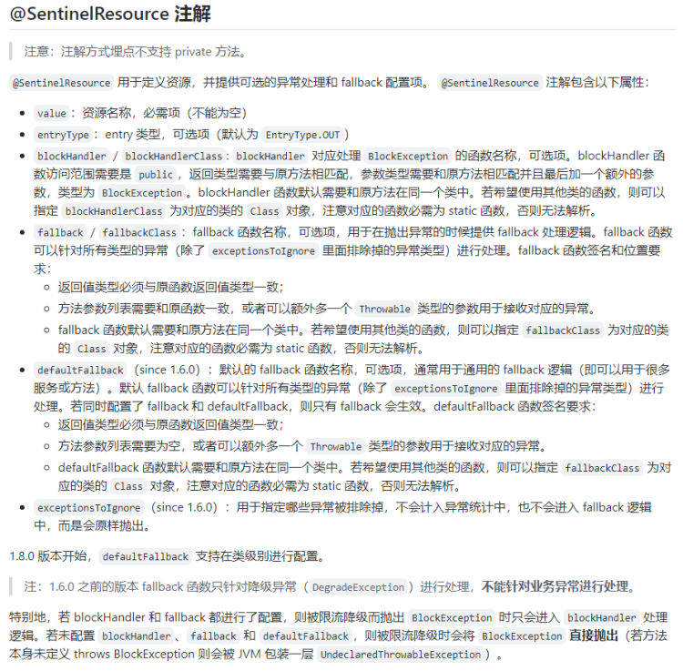
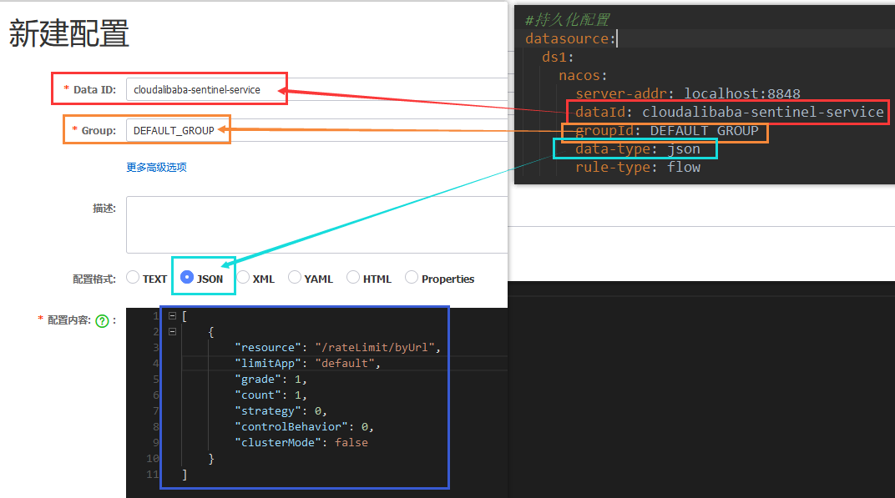

[Sentinel GitHub](https://github.com/alibaba/Sentinel)
# 1.Sentinel服务端
## 1.1 Windows 
下载好Sentinel的jar包后，使用java -jar命令运行，最后访问8080端口webui界面
默认账户密码都为sentinel

# 2.Sentinel客户端使用
## 2.1 依赖
```xml
<!--sentinel的限流配置持久化使用，如果不需要持久化可以不引入-->
<dependency>
  <groupId>com.alibaba.csp</groupId>
  <artifactId>sentinel-datasource-nacos</artifactId>
</dependency>
<!--Sentinel核心依赖-->
<dependency>
  <groupId>com.alibaba.cloud</groupId>
  <artifactId>spring-cloud-starter-alibaba-sentinel</artifactId>
</dependency>
<dependency>
    <groupId>com.alibaba.cloud</groupId>
    <artifactId>spring-cloud-starter-alibaba-nacos-discovery</artifactId>
</dependency>
<dependency>
    <groupId>org.springframework.cloud</groupId>
    <artifactId>spring-cloud-starter-openfeign</artifactId>
</dependency>
<dependency>
    <groupId>org.springframework.boot</groupId>
    <artifactId>spring-boot-starter-web</artifactId>
    </dependency>
<dependency>
    <groupId>org.springframework.boot</groupId>
    <artifactId>spring-boot-starter-actuator</artifactId>
</dependency>
```
## 2.2 配置
```yaml
server:
  port: 8401

spring:
  application:
    name: cloudalibaba-sentinel-service
  cloud:
    #nacos配置
    nacos:
      discovery:
        server-addr: localhost:8848 #Nacos服务注册中心地址
    #sentinel配置
    sentinel:
      transport:
        #配置Sentinel WebUI地址
        dashboard: localhost:8080
        #默认8719端口，假如被占用会自动从8719开始依次+1扫描,直至找到未被占用的端口
        port: 8719
management:
  endpoints:
    web:
      exposure:
        include: '*'
```
注：
spring.cloud.sentinel.transport.port端口配置（如上配置了8719）会在应用对应的机器上启动一个 HttpServer，
该 Server 会与 Sentinel 控制台做交互。比如 Sentinel 控制台添加了1个限流规则，
会把规则数据push给这个Http Server接收，Http Server再将规则注册到Sentinel中。
spring.cloud.sentinel.transport.port：指定与Sentinel控制台交互的端口，应用本地会启动一个占用该端口的Http Server


## 2.3 启动类
```java
import org.springframework.boot.SpringApplication;
import org.springframework.boot.autoconfigure.SpringBootApplication;
import org.springframework.cloud.client.discovery.EnableDiscoveryClient;

@EnableDiscoveryClient
@SpringBootApplication
public class SentinelMainApp8401 {
    public static void main(String[] args) {
        SpringApplication.run(SentinelMainApp8401.class, args);
    }
}
```

## 2.4 业务类
假设编写如下业务代码
```java
@RestController
public class Controller {
    @Value("${server.port}")
    private Integer port;

    @RequestMapping(value = "/sentinel/a")
    public String a() {
        return String.format("port:%s,result:a", port);
    }

    @RequestMapping(value = "/sentinel/b")
    public String b() {
        return String.format("port:%s,result:b", port);
    }
}
```
启动Sentinel服务端后，先多次访问业务接口如/sentinel/a，然后到Sentinel的WebUI可以
查看到如下监控图表则说明服务监控成功


## 2.5 流量控制
### 2.5.1 配置介绍
如下图展示了如何配置一个流控规则

1. 资源名：唯一名称，可以用URL路径或者使用@SentinelResource的value属性
如下方法：既可以用/sentinel/d表示资源名，也可以用sr_d表示。
```text
    @RequestMapping(value = "/sentinel/d")
    //使用URL的降级规则，测试发现只能转到系统默认降级方法，要使用自定义方法需要用SentinelResource的value值配置规则
    //注意blockHandler要和标注的方法返回值一致
    @SentinelResource(value = "sr_d", blockHandlerClass = MyBlockHandler.class, blockHandler = "handler1")
    public Object d() {
        return String.format("port:%s,result:d", port);
    }
```
2. 针对来源：Sentinel可以针对调用者进行限流，填写微服务名，默认default(不区分来源)
3. QPS+单机阈值:每秒钟的请求该api数量达到设定阈值的时候，进行流控模式策略，限流好像是1s
4. 线程数+单机阈值：当调用该api的线程数达到阈值的时候，进行流控模式策略
5. 是否集群：
6. 直接：直接调用流控效果选择的策略
7. 关联：关联资源触发了限流规则，则限流被资源。
如下：如果/sentinel/c触发了QPS超过1的规则，则sr_d会被快速失败，但是/sentinel/c没有任何影响
即关联的资源/sentinel/c触发了限流的规则，限流的是sr_d
8. 链路：只记录指定链路上的流量(指定资源从入口资源进来的流量，如果达到阈值，就进行限流)
链路没进行过实验！
9. 快速失败：就是直接运行限流方法
10. Warm UP：相关的参数有单机阈值、预热时长、codeFactor。codeFactor默认值是3
假设预热时长设置10，单机阈值30。那么，单机阈值/codeFactor=10。
那么这个接口，开始调用只能承受10的阈值，超过10的会直接失败，之后阈值会匀速增加到10s后达到30
11. 排队等待：匀速排队，让请求以匀速的速度通过，阈值类型必须设置为QPS，否则无效
这种方式主要用于处理间隔性突发的流呈，例如消息队列。想象一下这样的场景，
在某一秒有大虽的请求到来，而接下来的几秒则处于空闲状态，
我们希望系统能够在接下来的空闲期间逐渐处理这些请求，而不是在第一秒直接拒绝多余的请求。
注意：超时时间这个参数，超过单机阈值的请求只能在未来的时间窗口被处理，如果因为请求太多
在超过超时时间还没有被处理，则该请求会调用降级方法。


    
## 2.6 熔断降级

Sentinel熔断降级会在调用链路中某个资源出现不稳定状态时（例如调用超时或异常比例升高），
对这个资源的调用进行限制，让请求快速失败，避免影响到其它的资源而导致级联错误。
当资源被降级后，在接下来的降级时间窗口之内，对该资源的调用都自动熔断（默认行为是抛出 DegradeException）。
目前使用的是老版本
1. RT（平均响应时间）
* 老版本：当1s内持续进入5个请求，对应时刻的平均响应时间(秒级）均超过阈值（ count，以ms为单位)，那么在接下的时间窗口会发送熔断，注意Sentinel 默认统计的RT上限是4900 ms，超出此阈值的都会算作4900 ms，若需要变更此上限可以通过启动配置项-Dcsp.sentinel.statistic.max.rt=xxx来配置。
* 新版本：改名叫慢调用比例，选择以慢调用比例作为阈值，需要设置允许的慢调用 RT（即最大的响应时间），请求的响应时间大于该值则统计为慢调用。当单位统计时长（statIntervalMs）内请求数目大于设置的最小请求数目，并且慢调用的比例大于阈值，则接下来的熔断时长内请求会自动被熔断。经过熔断时长后熔断器会进入探测恢复状态（HALF-OPEN 状态），若接下来的一个请求响应时间小于设置的慢调用 RT 则结束熔断，若大于设置的慢调用 RT 则会再次被熔断
2. 异常比例
* 老版本：当每秒请求数>=5，并且每秒异常数超过设置的异常比例阈值，则在接下来设置的时间窗口内进行熔断
* 新版本：当单位统计时长（statIntervalMs）内请求数目大于设置的最小请求数目，并且异常的比例大于阈值，则接下来的熔断时长内请求会自动被熔断。经过熔断时长后熔断器会进入探测恢复状态（HALF-OPEN 状态），若接下来的一个请求成功完成（没有错误）则结束熔断，否则会再次被熔断。异常比率的阈值范围是 [0.0, 1.0]，代表 0% - 100%。
3. 异常数
* 老版本：当资源近1分钟的异常数目超过阈值之后会进行熔断。注意由于统计时间窗口是分钟级别的，若timewindow小于60s，则结束熔断状态后仍可能再进入熔断状态。所以时间窗口设置要大于60s
* 新版本：当单位统计时长内的异常数目超过阈值之后会自动进行熔断。经过熔断时长后熔断器会进入探测恢复状态（HALF-OPEN 状态），若接下来的一个请求成功完成（没有错误）则结束熔断，否则会再次被熔断。
## 2.7 热点限流/参数限流

热点即经常访问的数据，很多时候我们希望统计或者限制某个热点数据中访问频次最高的TopN数据，并对其访问进行限流或者其它操作。比如：
● 商品 ID 为参数，统计一段时间内最常购买的商品 ID 并进行限制
● 用户 ID 为参数，针对一段时间内频繁访问的用户 ID 进行限制
热点参数限制会统计传入参数中的热点参数，并根据配置的限流阈值与模式，对包含热点参数的资源调用进行限制。热点参数限流可以看作是一种特殊的流量控制，仅对包含热点参数的资源调用生效。 
假设定义如下方法：
```text
    @RequestMapping(value = "/sentinel/c")
    @SentinelResource(value = "sr_c", blockHandler = "cHandler")
    public String c(String key, String value) {
        return String.format("port:%s,result:c", port);
    }
```
如下表示了对key进行限制，就是如果/sentinel/c接口，带了参数key且qps>1才会触发，
并且在下面设置了列外参数项目，即key=1时，qps=10才会触发限流。
可以不设置列外参数值，那么无论key是什么值，只要满足带了参数key且qps>1就会触发限流。


## 2.8系统规则
Sentinel 系统自适应限流从整体维度对应用入口流量进行控制，结合应用的 Load、CPU 使用率、总体平均 RT、入口 QPS 和并发线程数等几个维度的监控指标，通过自适应的流控策略，让系统的入口流量和系统的负载达到一个平衡，让系统尽可能跑在最大吞吐量的同时保证系统整体的稳定性。
系统保护规则是应用整体维度的，而不是资源维度的，并且仅对入口流量生效。入口流量指的是进入应用的流量（EntryType.IN），比如 Web 服务或 Dubbo 服务端接收的请求，都属于入口流量。
系统规则支持以下的模式：
● Load 自适应（仅对 Linux/Unix-like 机器生效）：系统的 load1 作为启发指标，进行自适应系统保护。当系统 load1 超过设定的启发值，且系统当前的并发线程数超过估算的系统容量时才会触发系统保护（BBR 阶段）。系统容量由系统的 maxQps * minRt 估算得出。设定参考值一般是 CPU cores * 2.5。
● CPU usage（1.5.0+ 版本）：当系统 CPU 使用率超过阈值即触发系统保护（取值范围 0.0-1.0），比较灵敏。
● 平均 RT：当单台机器上所有入口流量的平均 RT 达到阈值即触发系统保护，单位是毫秒。
● 并发线程数：当单台机器上所有入口流量的并发线程数达到阈值即触发系统保护。
● 入口 QPS：当单台机器上所有入口流量的 QPS 达到阈值即触发系统保护。

## 2.9 @SentinelResource/降级与异常处理
如果需要自定义降级与异常处理方法，则需要搭配@SentinelResource使用。
需要注意的是，因sentinel中配置的规则而产生的降级不属于异常，它触发的是blockHandler
而运行时产生的RuntimeException需要搭配fallback使用。
注意：
1. 自定义兜底方法的**方法返回值**、**方法参数**，必须和@SentinelResource的方法一致。且还需要加异常抛出参数
否则Sentinel会因为不匹配问题，不调用自定义的兜底方法，而继续调用Sentinel的默认兜底方法。
@Sentinel的属性含义如下图所示

* 使用blockHandler
```text
    //使用blockHandler
    @RequestMapping(value = "/sentinel/c")
    @SentinelResource(value = "sr_c", blockHandler = "cHandler")
    public String c(String key, String value) {
        return String.format("port:%s,result:c", port);
    }

    public String cHandler(String key, String value, BlockException e) {
        return "c method error";
    }
```
* 使用blockHandlerClass和blockHandler，将handler方法抽离到blockHandlerClass中
```text
    //使用URL的降级规则，测试发现只能转到系统默认降级方法，要使用自定义方法需要用SentinelResource的value值配置规则
    //注意blockHandler要和标注的方法返回值一致
    @RequestMapping(value = "/sentinel/d")
    @SentinelResource(value = "sr_d", blockHandlerClass = MyBlockHandler.class, blockHandler = "handler1")
    public Object d() {
        return String.format("port:%s,result:d", port);
    }
```
* 使用fallback自定义运行时异常处理方法
```text
 //blockHandler只会因规则不符合触发，代码运行时异常并不会触发，fallback是管理代码运行时异常
    //注意fallback或者blockHandler要生效，则对应的方法参数和返回值必须和原方法对应，并加上对应的异常参数
    @RequestMapping(value = "/sentinel/e/{id}")
    @SentinelResource(value = "sr_e", blockHandler = "eHandler", fallback = "eErrorHandler",
            exceptionsToIgnore ={MyException.class} //fallback忽略指定异常，忽略的异常会正常抛出
    )
    public Object e(@PathVariable("id") Integer id) {
        if (id == 0) {
            return String.format("port:%s,result:e", port);
        } else if (id == 2) {
            return 1 / 0;
        } else {
            throw  new MyException();
        }
    }

    public Object eHandler(Integer id, BlockException e) {
        return "e method limit";
    }

    public Object eErrorHandler(Integer id, Throwable throwable) {
        return "e method error";
    }
```

## 2.10 Sentinel+Feign
1. 引入Feign依赖
```xml
<!--SpringCloud openfeign -->
<dependency>
  <groupId>org.springframework.cloud</groupId>
  <artifactId>spring-cloud-starter-openfeign</artifactId>
</dependency>
```
2. 配置
```yaml
# 激活Sentinel对Feign的支持
feign:
  sentinel:
    enabled: true
```
3. Service端指定兜底方法
```text
import com.atguigu.springcloud.entities.CommonResult;
import com.atguigu.springcloud.entities.Payment;
import org.springframework.cloud.openfeign.FeignClient;
import org.springframework.web.bind.annotation.GetMapping;
import org.springframework.web.bind.annotation.PathVariable;

// 指明调用失败的兜底方法在PaymentFallbackService
// 使用 fallback 方式是无法获取异常信息的，
// 如果想要获取异常信息，可以使用 fallbackFactory参数
@FeignClient(value = "nacos-payment-provider", fallback = PaymentFallbackService.class)
public interface PaymentFeignService {
    //去nacos-payment-provider服务中找相应的接口
    // 方法签名一定要和nacos-payment-provider中controller的一致
    // 对应9003、9004中的方法
    @GetMapping(value = "/paymentSQL/{id}")
    public CommonResult<Payment> paymentSQL(@PathVariable("id") Long id);
}
```
```text
import com.atguigu.springcloud.entities.CommonResult;
import com.atguigu.springcloud.entities.Payment;
import org.springframework.stereotype.Component;

@Component   //不要忘记了
public class PaymentFallbackService implements PaymentFeignService {
    //如果nacos-payment-consumer服务中的相应接口出事了，我来兜底
    @Override
    public CommonResult<Payment> paymentSQL(Long id) {
        return new CommonResult<>(444,"服务降级返回,没有该流水信息-------PaymentFallbackService",new Payment(id, "errorSerial......"));
    }
}
```
4. 启动类
加上@EnableFeignClient注解开启OpenFeign
5. 注意
* 如果yaml没有配置Sentinel对Feign的支持，就不会执行降级方法，而是直接报错误页面。
## 2.11 规则持久化
配置进Sentinel的微服务新增的限流规则，微服务关闭后就会丢失，所以配置都限流规则都是临时的。 
为了持久化配置，需要将限流配置规则持久化进Nacos保存。
当微服务下线后再上线，如果持久化了配置，只要再次访问对应微服务的URL地址，sentinel控制台的流控规则就能看到持久化的规则。
只要nacos里面的配置不删除，sentinel上的流控规则就持续存在。（也可以持久化到文件，redis，数据库等）
1. 依赖
```xml
<!--SpringCloud ailibaba sentinel-datasource-nacos 持久化-->
<dependency>
  <groupId>com.alibaba.csp</groupId>
  <artifactId>sentinel-datasource-nacos</artifactId>
</dependency>
```
2. 持久化配置
注意：如下配置省略了非持久化的别的配置
```yaml
spring:
  application:
    name: cloudalibaba-sentinel-service
  cloud:
    sentinel:
      #持久化配置
      datasource:
        ds1:
          nacos:
            server-addr: localhost:8848 #nacos地址
            dataId: cloudalibaba-sentinel-service
            groupId: DEFAULT_GROUP
            data-type: json
            rule-type: flow
```
3. 在nacos编写配置规则

```json
[
    {
        "resource": "/rateLimit/byUrl",
        "limitApp": "default",
        "grade": 1,
        "count": 1,
        "strategy": 0,
        "controlBehavior": 0,
        "clusterMode": false
    }
]
```
resource：资源名称；
limitApp：来源应用；
grade：阈值类型，0表示线程数，1表示QPS；
count：单机阈值；
strategy：流控模式，0表示直接，1表示关联，2表示链路；
controlBehavior：流控效果，0表示快速失败，1表示Warm Up，2表示排队等待；
clusterMode：是否集群。
注意：这里如果要配nacos的命名空间（public、dev、test）的话，应该是配namespace的id，不是名称