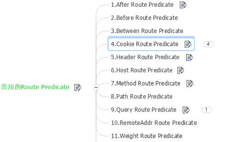

# 1.gateway的作用与功能
gateway相当于内部网关，而Nginx相当于外部网关，结构如下图所示

## 1.1 gateway的几大功能
### 1.1.1 Route路由
路由的意思就是将一个请求发送到指定的地方，假如外界有一个访问Nginx的请求叫sj.cloud/payment，
gateway接收到这个请求后，要转发到payment这个微服务模块，而在模块payment模块在注册中心注册的服务叫payment-service
所以请求由外界的sj.cloud/payment->nginx->gateway->payment-service/payment
注意：路由可以是ip也可以是dns
### 1.1.2 Predicate断言
断言的作用就是，当收到一个请求时，通过断言来确定将这个请求与哪个路由对应起来（可能找不到对应路由）
假如有一个断言
-Path: /payment/*与路由sj.cloud绑定，那么所有路径地址含/payment/的请求，都会被路由到sj.cloud
gate除了提供了-Path的URL路径地址断言，还提供了如时间断言，Cookie断言等等
如时间断言-After，就表示了，这个请求必须在某个时间之后才会生效


### 1.1.3 Filter过滤器
过滤器的作用就是当某个路由被选中时，可以对Request和Response请求进行操作或者拦截
* 过滤器分为全局过滤器和专用过滤器，全局过滤器对所有进入gateway的请求都其作用，专用过滤器对具体路由起作用。
* 过滤器生命周期有两个pre和post
* 一个请求可以配置多个过滤器

# 2.Gateway的使用
## 2.1必须的依赖
```xml
<dependency>
    <groupId>org.springframework.cloud</groupId>
    <artifactId>spring-cloud-starter-gateway</artifactId>
</dependency>
```
注意：
1. 除了gateway的依赖还需要引入一个服务注册的依赖，如：nacos、consul等
2. gateway服务不能引入spring-boot-starter-web和spring-boot-starter-actuator的依赖，否则无法正常启动
## 2.2 相关配置
```yaml

```