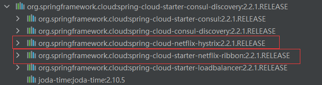
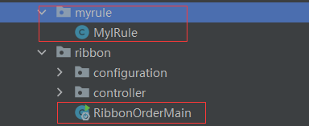
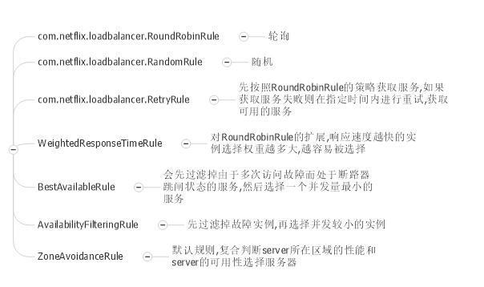

# ribbon切换负载均衡策略使用步骤
区别于nginx，ribbon主要作为微服务端之间调用的负载均衡
注意：很多服务注册如consul、eureka、zk搭配RestTemplate能实现负载均衡，因为它们默认引入了ribbon的依赖
通过在@LoadBalanced+RestTemplate能实现RoundRobin的负载均衡策略(轮询)。
但是如果要切换策略则需要按如下步骤进行
1. 依赖
```xml

<dependency>
    <groupld>org.springframework.cloud</groupld>
    <artifactld>spring-cloud-starter-netflix-ribbon</artifactld>
</dependency>
```
注意：很多服务发现的starter自带了ribbon所以可以不用引入ribbon依赖

2. 在SpringBootApplication扫描不到的包创建自定义负载均衡配置类
**因为如果在扫描的到的包放置配置类，官方说了会被所有的Ribbon客户端共享**
如下MyIRule不在RibbonOrderMain的同包或者子包下，所以扫描不到

3. 编写配置类
如下切换成随机的策略（还有别的策略）
```java
@Configuration
public class MyIRule {
    @Bean
    public IRule myRule() {
        // 定义为随机的负载均衡策略
        return new RandomRule();
    }
}
```

4. 配置RestTemplate
```java
@Configuration
public class RestTemplateConfiguration {

    @Bean
    @LoadBalanced
    public RestTemplate restTemplate() {
        return new RestTemplate();
    }
}
```
5. 在启动类上添加@RibbonClient注解
name用调用的服务类，它的值是在服务注册中的值，configuration填配置类
```java
@SpringBootApplication
@EnableDiscoveryClient
@RibbonClient(name = "cloud-provider-payment", configuration = MyIRule.class)
public class RibbonOrderMain {
    public static void main(String[] args) {
        ConfigurableApplicationContext run = SpringApplication.run(RibbonOrderMain.class, args);
    }
}
```
6. 使用RestTemplate发请求
```java
@RestController
public class Controller {

    @Resource
    private RestTemplate restTemplate;

    public static final String INVOKE_URL = "http://cloud-provider-payment";

    @RequestMapping(value = "/ribbon/order")
    public String order() {
        String forObject = restTemplate.getForObject(INVOKE_URL + "/consul/payment", String.class);
        return forObject;
    }

}
```

# 自定义负载均衡算法
其实和ribbon已经没有什么关系，原理是通过DiscoveryClient获取服务实例，然后用自己的方法
挑选实例。
1. 引入必要的依赖（服务注册的依赖）
2. 通过DiscoveryClient来实现负载均衡算法
如下通过DiscoveryClient来实现了一个RoundRobin算法（注意并发问题 ）
```java
public class MyLoadBalancer implements LoadBalancer {
    @Resource
    private DiscoveryClient discoveryClient;
    private AtomicInteger round = new AtomicInteger(0);
    private String serviceId;

    //传入服务中心注册的服务名称
    public MyLoadBalancer(String serviceId) {
        this.serviceId = serviceId;
    }

    @Override
    public ServiceInstance instances() {
        //通过discoveryClient获取该服务的实例
        List<ServiceInstance> instances = discoveryClient.getInstances(serviceId);
        //考虑了并发问题的轮询实现
        int size = instances.size();
        int i = round.get();
        int index = i % size;
        while (!round.compareAndSet(i, index+1)) ;
        return instances.get(index);
    }
}
```
3. 在启动类加上@EnableDiscoveryClient
4. 配置RestTemplate但是不要加@LoadBalanced注解
```java
@Configuration
public class RestTemplateConfiguration {
    @Bean
    public RestTemplate restTemplate() {
        return new RestTemplate();
    }
}
```
5. 使用自实现的负载均衡类
```java
@RestController
@Slf4j
public class Controller {

    @Resource
    private LoadBalancer myLoadBalancer;

    @Resource
    private RestTemplate restTemplate;
    

    @RequestMapping(value = "/ribbon/order")
    public String order() {
        ServiceInstance instances = myLoadBalancer.instances();
        log.info("URI:{}",instances.getUri());
        String forObject = restTemplate.getForObject(instances.getUri() + "/consul/payment", String.class);
        return forObject;
    }

}

```