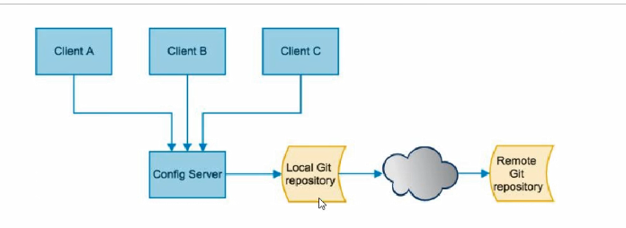
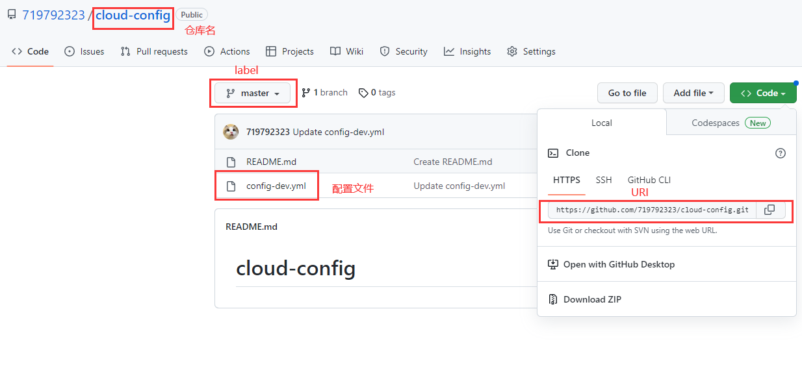

# 1.config框架下成员组成与关系

## 1.1Client端
client端的角色就是一个个功能微服务模块，它通过请求Config Server端去拉取最新的配置。
微服务模块每次启动时会主动向Config Server拉取配置，如果无法正确拉取，则该服务无法正常
启动。注意启动后的微服务模块，并不会主动向Config Server拉取变动（注意config是这个模式，
nacos不同），需要外界主动向各微服务模块发起一个post请求，让微服务模块被动的去向Config Server拉取更新。
## 1.2Config Server端
Config Server是**微服务**的配置中心模块，所以也是一个微服务模块。它的职责是向远程配置仓库(如：github)
主动拉取配置变动，并将配置存储到本地仓库。Config Server与Client不同，Config Server会定时访问配置仓库拉取更新。Config Server
同时也向Client端提供配置拉取服务，Client向Config Server读取配置信息。
# 2.Config使用步骤
## 2.1必要的依赖
### 2.1.1ConfigServer端
注意：
1. Server端不需要引入web依赖
2. 如果需要Client集体刷新才需要引入bus依赖
3. 按需引入一个服务注册依赖
```xml
<dependency>
    <groupId>org.springframework.cloud</groupId>
    <artifactId>spring-cloud-config-server</artifactId>
</dependency>
<dependency>
    <groupId>org.springframework.boot</groupId>
    <artifactId>spring-boot-starter-actuator</artifactId>
</dependency>
<!--bus依赖-->
<dependency>
    <groupId>org.springframework.cloud</groupId>
    <artifactId>spring-cloud-starter-bus-amqp</artifactId>
</dependency>
```
### 2.1.2Client端
注意:
1. 按需引入一个具体的服务注册依赖
2. 如果需要Client集体刷新才需要引入bus依赖
```xml
 <dependency>
    <groupId>org.springframework.cloud</groupId>
    <artifactId>spring-cloud-starter-config</artifactId>
 </dependency>
<dependency>
    <groupId>org.springframework.boot</groupId>
    <artifactId>spring-boot-starter-actuator</artifactId>
</dependency>
<dependency>
    <groupId>org.springframework.boot</groupId>
    <artifactId>spring-boot-starter-web</artifactId>
</dependency>
<!--bus-->
<dependency>
    <groupId>org.springframework.cloud</groupId>
    <artifactId>spring-cloud-starter-bus-amqp</artifactId>
</dependency>
```
## 2.2建立远程仓库
创建一个github仓库,并上传一个配置文件如下图
注意:uri label search-paths(仓库名) 文件名的对应关系

## 2.3配置
### 2.3.1Config Server端配置
注意:
1. 省略了端口与服务注册的配置
2. 如果不需要bus功能,则不需要配置rabbitmq和暴露bus相关刷新端点的两部分配置内容
3. Config Server端配置涉及了uri label search-paths等,注意与上面的图对应
```yaml
spring:
  application:
    name: cloud-config-center
  cloud:
    config:
      server:
        git:
          #git clone提供的地址
          uri: https://github.com/719792323/cloud-config.git
          search-paths:
            #git的仓库名
            - cloud-config
      # 选择git的仓库的哪个分支
      label: master
  #配置rabbitmq
  rabbitmq:
    host: 192.168.56.128
    port: 5672
    username: guest
    password: guest

#暴露bus相关刷新端点
management:
  endpoints:
    web:
      exposure:
        include: 'bus-refresh'
```
### 2.3.2Client端配置
注意:
1. 配置文件名需要指定bootstrap.yml,而不是application.yml,因为需要从配置中心拉取配置
2. 省略了端口与服务注册的配置
3. 注意label name profile uri与git仓库图的对应,尤其是name与profile和具体文件config-dev.yml的对应
4. 端口暴露无论是否需要bus功能都需要配置
```yaml
spring:
  application:
    name: cloud-config-client
  cloud:
    config:
      label: master #分支名
      name: config #配置文件名
      profile: dev #填要读取的文件由-的后缀，config-dev.yml
      uri: http://127.0.0.1:3344 #配置服务器地址Config Server地址
  #配置rabbitmq(使用bus才需要)
  rabbitmq:
    host: 192.168.56.128
    port: 5672
    username: guest
    password: guest

#暴露监控端口，开启动态刷新
management:
  endpoint:
    health:
      show-details: always
  endpoints:
    web:
      exposure:
        include: "*"
      base-path: /actuator
    enabled-by-default: true
```
## 2.4启动类
### 2.4.1 Server端
```java
@SpringBootApplication
@EnableConfigServer
@EnableEurekaClient
public class Config3344 {
    public static void main(String[] args) {
        SpringApplication.run(Config3344.class, args);
    }
}
```
注意:由于ConfigServer需要访问,如github远程仓库,如果网络连接出现问题可以设置jvm代理
-Dhttp.proxyHost=127.0.0.1
-Dhttp.proxyPort=7890
-Dhttps.proxyHost=127.0.0.1
-Dhttps.proxyPort=7890
### 2.4.2 Client端
@SpringBootApplication
@EnableConfigServer
@EnableEurekaClient

## 2.5读取配置
### 2.5.1ConfigServer读取
访问地址:ConfigServer的URI/label/文件名
注意:label是分支
如访问master分支下的config-dev.yml
http://localhost:3344/master/config-dev.yml

### 2.5.2Client端
启动时会自动向server拉取配置,但是如果配置中心更新了配置,Client也要更新则需要使用如下步骤:
1. controller上标记注解@RefreshScope
```java
@RestController
@RefreshScope //动态更新配置注解
public class Controller {

    @Value("${version}")
    private String version;

    @RequestMapping(value = "/config/v")
    public String getVersion() {
        return version;
    }
}
```
2. 向Client端发起更新指令
假设Client端的URI是localhost:3355
curl -X POST "http://localhost:3355/actuator/refresh"
## 2.6Bus使用
1. 安装好rabbitmq
2. 导入相关配置和依赖
3. 全体更新
指令:curl -X POST "http://localhost:3344/actuator/bus-refresh"
注意:localhost:3344是Server端的URI
4. 指定更新
指令：curl -X POST http://localhost:配置中心的端口号/actuator/bus-refresh/{destination}
如:如指定更新3355,curl -X POST "http://localhost:3344/actuator/bus-refresh/config-client:3355"
注意:config-client是3355在注册中心的名称