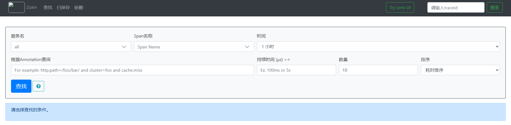

# 1使用步骤
## 1.1运行zipkin
zipkin相当于指标收集服务器用于收集微服务端的调用链路数据,下载好zipkin的jar后,使用java -jar运行jar包即可启动服务
运行正确的话,访问9411端口可以查看zipkin的WebUI


## 1.2要监控的微服务项目
### 1.2.1引入依赖
```xml
<dependency>
    <groupId>org.springframework.cloud</groupId>
    <artifactId>spring-cloud-starter-zipkin</artifactId>
</dependency>
```
### 1.2.2相关配置
```yaml

```