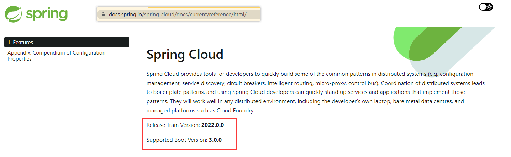

# 构建父子工程步骤
1. 设置父工程打包方式为pom
2. 删除父亲工程的src文件夹（由idea插件的maven项目默认有src文件夹，但是父工程不需要）
3. 设置properties，定义jar包版本或者其他定义内容
4. dependencyManagement
* 子项目逐级查找
使用pom.xml中的dependencyManagement元素能让所有在子项目中引用一个依赖而不用显式的列出版本号。
Maven 会沿着父子层次向上走，直到找到一个拥有dependencyManagement元素的项目，然后它就会使用这个dependencyManagement元素中指定的版本号。
这样做的好处就是，如果有多个子项目都引用同一样的依赖,则可以避免在每个使用的子项目里都声明一个版本号,这样想升级或切换到另一个版本时,
只需在顶层父容器里更新,而不需要一个一个子项目的修改l;另外如果某个子项目需要另外的一个版本,只需声明version版本。
* 合并引入
比如合并引入一个配置的xml，如下。注意需要写type=pom和scope=import
```xml
            <dependency>
                <groupId>org.springframework.boot</groupId>
                <artifactId>spring-boot-dependencies</artifactId>
                <version>2.2.2.RELEASE</version>
                <type>pom</type>
                <scope>import</scope>
            </dependency>
```

# SpringBoot与SpringCloud的项目版本关系
需要在官网查看建议，不按建议来很容易出问题
到官网查看springcloud的文档会给出该对应关系

